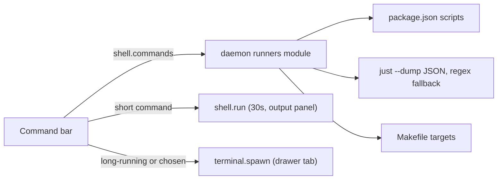

# Command bar runners, with justfiles as first-class citizens

## Today

The command bar ([desktop-next/src/shell/command-bar.tsx](desktop-next/src/shell/command-bar.tsx), 269 lines) builds its list in the browser, from `package.json` read through `file.contents`. It runs everything with `shell.run` (in [src/daemon/server/dispatch/surface.rs](src/daemon/server/dispatch/surface.rs)), which caps a run at 30 seconds with no streaming.

Daintree's reference is `electron/services/RunCommandDetector.ts`: one detector per file type, merged into one list and cached for 60 seconds. Its justfile support is a regex over the file.

## Shape




Detection moves to the daemon, so it reads the files directly, can run `just`, and resolves the task worktree the same way `shell.run` does.

## Daemon: `src/daemon/runners/`

A new directory module, every file under 300 lines:

- `mod.rs` holds the `RunCommand` type, `detect(root)`, and a cache keyed by folder plus the modification times of the three files.
- `npm.rs` reads `package.json` scripts. The package manager comes from the lockfile: `bun.lock` or `bun.lockb` gives `bun run`, `pnpm-lock.yaml` gives `pnpm`, `yarn.lock` gives `yarn`, otherwise `npm run`.
- `make.rs` reads Makefile targets, skipping `.PHONY` and other special targets, pattern rules, variables and targets that start with `_`. A `##` comment, inline or on the line above, becomes the description (the common self-documenting convention).
- `just/mod.rs`, `just/dump.rs` and `just/parse.rs` handle justfiles, described below.

The wire type `RunCommand` is added to `crates/warpforge-protocol` and mirrored in `packages/protocol`:

```rust
pub struct RunCommand {
    pub id: String,                 // "just:test", "npm:dev", "make:build"
    pub source: RunSource,          // Npm | Just | Make
    pub name: String,               // recipe or script name, module path for just
    pub command: String,            // exact shell line, e.g. "just db::migrate"
    pub description: Option<String>,
    pub group: Option<String>,      // just [group("...")]
    pub params: Vec<RunParam>,      // name, kind (required | default | variadic+ | variadic*), default
    pub confirm: Option<String>,    // just [confirm] / [confirm("...")]
    pub aliases: Vec<String>,
    pub long_running: bool,
    pub is_default: bool,           // the justfile's first or [default] recipe
}
```

A new RPC, `shell.commands { project, task_id }`, returns `{ commands, errors }`. `errors` holds one readable line per source that failed, for example a justfile that doesn't parse, so the bar can show it rather than silently dropping recipes. `shell.run` is unchanged.

## Justfiles as first-class citizens

- **Finding the file.** Use the same names `just` accepts (`justfile`, `Justfile`, `.justfile`, any capitalisation), searched from the worktree upward to the repository root, as `just` does.
- **Exact reading.** Run `just --justfile <path> --dump --dump-format json` with a 5-second timeout. From that output:
  - recipes, with their doc comments or `[doc("...")]` attribute
  - parameters, with default values and variadic `+` or `*`
  - `[group("...")]`
  - `[private]` and `_name` recipes, which are hidden
  - `[confirm]` and `[confirm("message")]`
  - aliases
  - the default recipe
  - modules (`mod foo`), walked recursively and run as `just foo::recipe`
  The JSON shape is pinned by tests against fixtures captured from `just` 1.58.
- **Fallback.** When `just` isn't installed or the dump fails, a regex port of Daintree's parser reads names, `#` descriptions, `_private` and parameters from the recipe line. Recipes from the fallback carry a note: "Install just for exact recipes". That note appears only where `just` itself is missing; a justfile that doesn't parse shows its error instead.
- **Long-running hints.** A recipe is marked long-running when its name or body matches dev, serve, start, watch, preview, up, run or tail, or when its body calls a known server command. The user can always override that per run (see below).

## Command bar

Split `command-bar.tsx` into a folder, `shell/command-bar/`, before adding to it:

- `index.tsx`: the field and popover
- `use-commands.ts`: fetch `shell.commands` when the field opens, refresh on worktree change
- `run-dialog.tsx`: parameters and confirm
- `output.tsx`: the result panel and running terminals

Behaviour:

- **Groups, in order.** Saved, then Just (subgrouped by justfile group; the default recipe first and marked "default"), then Package scripts, then Make, then History. Each item shows its description in muted text after the name, and its aliases count toward filtering.
- **Parameters.** Choosing a recipe that takes parameters opens a small dialog with one field per parameter, prefilled with defaults. Variadic parameters accept several values. Required ones must be filled. Values are shell-quoted when the command line is built.
- **Confirm.** A recipe with `[confirm]` asks before it runs, using its own message when the justfile gives one.
- **Where it runs.** Long-running commands start in the terminal drawer via `terminal.spawn` with `task_id`, so they run in the same worktree, and the drawer opens on the new tab. Short commands use `shell.run` and the output panel as today. Shift-Return on any item flips the choice for that run, and the popover footer says so ("Return runs here · Shift-Return opens a terminal"). A `shell.run` that hits the 30-second limit offers "Run in terminal" on its error.
- **Errors.** A source error (bad justfile, unreadable `package.json`) shows as one muted line at the bottom of the popover.
- **Palette.** The same commands appear in ⌘K as "Run: just test", "Run: bun run dev" and so on, through the existing palette actions in `shell/palette/palette-actions.ts`.

## Tests

- **Rust.**
  - `just` dump parsing against fixtures: groups, docs, params with defaults and variadics, confirm, private, aliases, modules, default recipe.
  - The regex fallback, using Daintree's test cases.
  - Makefile targets and `##` descriptions.
  - The lockfile-to-package-manager mapping.
  - Upward justfile search.
  - The cache rebuilding when a file's modification time changes.
  - A live test that runs real `just` when it's installed and is skipped otherwise.
- **TypeScript.**
  - Building the command line from parameters, with shell quoting.
  - Ordering items into groups.
  - The long-running and Shift-Return routing.

## Verify

- `cargo fmt`, clippy (only the two known existing findings), `cargo test --bin orchestrai`, `cargo test -p warpforge-protocol`
- `desktop-next`: typecheck, lint, test, build; then the `desktop` typecheck
- Add a demo fixture: a justfile with groups, a parameterised recipe, a confirm recipe and a module. Take demo screenshots of the grouped list, the parameter dialog, the confirm prompt, and a long-running recipe opening in the drawer.
- Real check on the running OrchestrAI daemon, using a scratch project with a real justfile, Makefile and `package.json`: exact recipes from `just --dump`, a parameterised recipe run, a confirm recipe, `just dev` opening in the drawer, and the fallback list with `just` hidden from `PATH`.
- Add a changeset and an ADR addendum to 0029 (detection moved to the daemon, run routing). Clean up scratch files. Don't commit.

## Out of scope

- Taskfile, Procfile, mise, Django, Composer and devcontainer detection (you chose core only). The runners module makes each one a single file to add later.
- Editing justfiles from the app.

