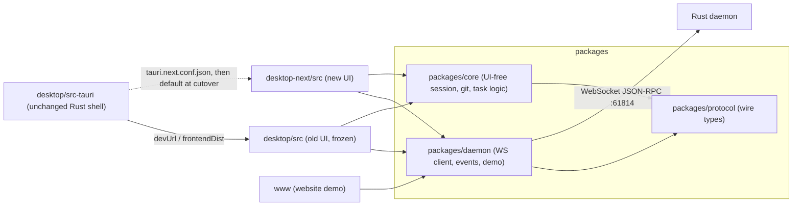
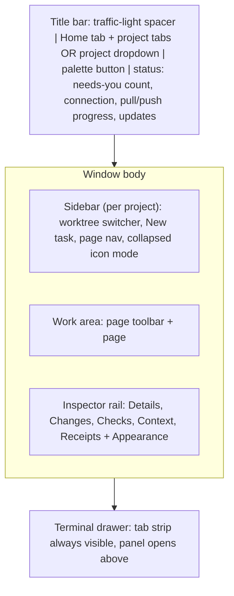

# OrchestrAI desktop UI redo (desktop-next)

## 0. Ground rules for whoever executes this

- **Source of truth:**
  - What exists today: [docs/product/INVENTORY.md](docs/product/INVENTORY.md).
  - Target look and behaviour: the mock in [experiments/orchestrai-shell/src](experiments/orchestrai-shell/src).
  - Why: [docs/design/DESIGN-PHILOSOPHY.md](docs/design/DESIGN-PHILOSOPHY.md) and [docs/design/SHARP-EDGES.md](docs/design/SHARP-EDGES.md).
  - Section 6 of this plan is the contract: every old control has exactly one new home.
- **Repo rules (CLAUDE.md, AGENTS.md):**
  - Files stay at or under 400–500 lines; a page is a directory (`pages/changes/…`).
  - Run lint, typecheck, test, and build before each commit.
  - Every commit carries a changeset. Use `bun run changeset --empty` for internal build-out commits, and a real customer-facing changeset only at cutover.
  - Push to `origin2`.
  - Scratch files go under `$TMPDIR`.
- **Share logic, copy components:**
  - UI-free code (protocol, daemon client, session and git logic) moves into shared packages that both frontends import.
  - React components are copied into desktop-next and restyled, never shared. The old copies die at cutover, so nothing is duplicated for long.
- **Old app keeps working:** after every phase, `desktop/` still passes `lint`, `typecheck`, `test`, and `build`, and the website (`www/`) still builds. Users keep the old UI until cutover.
- **No daemon or protocol changes in phases 0–8.** Parity uses only RPCs that exist today. Phase 9 is the only phase that touches Rust.

## 1. Architecture

**Workspace:**

- Add bun workspaces to the root [package.json](package.json): `packages/*`, `desktop`, `desktop-next`, `www`.
- Update [.github/workflows/ci.yml](.github/workflows/ci.yml) so every job runs `bun install --frozen-lockfile` at the repo root.
- Add a `desktop-next-web` job that mirrors `desktop-web`: lint, typecheck, test, build.
- Add `desktop-next/package.json` to [scripts/sync-version.mjs](scripts/sync-version.mjs).

**Shared packages (phase 0):**

- `packages/protocol`: move [desktop/src/protocol](desktop/src/protocol) unchanged. It is hand-written with zero UI imports.
- `packages/daemon`:
  - Move [desktop/src/daemon](desktop/src/daemon) along with `lib/sessionStream.ts`, `lib/sessionTiming.ts`, and the task-forget part of `lib/sessionStore/`.
  - Remove its one upward import (`events.ts` calls `queryClient.invalidateQueries(["backlog"])` from `query.ts`). Replace it with a callback, `daemon.onInvalidate(keys => …)`, which each app wires to its own QueryClient.
  - Move the demo fixtures from `www/src/components/landing/demo/fixtures.ts` here, so desktop-next can boot with `?demo`.
- `packages/core`: grows on demand. When a new page needs a UI-free module from `desktop/src/lib/`, move it here and update the old imports in the same commit. Likely candidates:
  - Session: `session*`, `transcriptGroups`, `transcriptKeys`, `continueSession`.
  - Attention and tasks: `attentionRail`, `taskGroups`, `taskFailures`, `taskOrigin`.
  - Factory, workflow, and automations: `factory`, `workflow`, `automationSchedule`.
  - Inbox and pull requests: `inbox*`, `pull*`, `prFeedback`.
  - Look and platform: `themes`, `platform`, `updater`.
  - Editor: `codemirror*`, `changeGutter`.
- Update the old app's and www's import aliases (`@app/daemon` in www) in the same commits.

**desktop-next scaffold:**

- **Stack:** Vite 8, React 19, TypeScript, Tailwind 4, and the React Compiler (same as desktop).
- **UI kit:** shadcn radix-nova primitives copied from [experiments/orchestrai-shell/src/components/ui](experiments/orchestrai-shell/src/components/ui).
- **Libraries:** zustand, @tanstack/react-query, cmdk, react-resizable-panels v4, sonner, xterm, CodeMirror 6, react-markdown with remark-gfm, mermaid, react-grid-layout, @legendapp/list (with desktop's patch), and @tauri-apps/api with its plugins.
- **Tooling:** oxlint, oxfmt with `semi: false`, and Vitest with jsdom (copy `desktop/src/test/setup.ts`).
- **Dev server:** port 5174 with `strictPort`. Scripts match desktop: `dev`, `build`, `lint`, `typecheck`, `test`, `format`.

**Running Tauri against desktop-next before cutover:**

- Add `desktop/src-tauri/tauri.next.conf.json`, which overrides:
  - `build.devUrl` to `http://localhost:5174`.
  - `build.frontendDist` to `../../desktop-next/dist`.
  - `beforeDevCommand` / `beforeBuildCommand` to stage the sidecar (as today), then run desktop-next's `dev` / `build` with `cwd: ../desktop-next`.
- Run it with `bun tauri dev --config src-tauri/tauri.next.conf.json`. The Rust commands don't change.

**ADR:** write `docs/adr/0025-project-first-shell.md`. It covers:

- Projects as the namespace, Home, and the fixed regions.
- One action list.
- The shortcut changes (section 7).
- Moving toasts to the inbox.
- Rejected alternatives: an in-place rewrite, and a big-bang rewrite.

## 2. Target layout (single Tauri window)

- **Window:** one Tauri window. There is no fake desktop, dock, window geometry, or second app.
  - Drop from the mock: `window/desktop.tsx`, `app-window.tsx`, `use-window-geometry.ts`, `window-controls.tsx`, `use-window-chrome.ts`, `lib/apps.ts`, and `layoutStore.appFrame`.
  - The title bar keeps a 78 px left spacer for the native overlay traffic lights.
  - The title bar's empty space carries `data-tauri-drag-region`, so dragging there moves the window.
- **Window state:** the mock's per-window `AppSession` becomes one `useShellStore` with the same fields minus geometry.
  - `projectNav` (tabs or dropdown) becomes an app-wide Appearance setting, defaulting to tabs.
  - Fields: `openProjects`, `project`, `home`, `pages`, `selection`, `inspector`, `terminal`, `focus`.
- **Projects** come from the daemon snapshot (`state.snapshot.projects`), not mock data. A project tab shows a needs-you or running count derived from snapshot tasks.
- **Sidebar nav per project:** the mock's [pages.tsx](experiments/orchestrai-shell/src/pages.tsx) groups, plus a **Files** page.
  - Work: Board (G B), Inbox (G I).
  - Knowledge: Memory.
  - Code: Changes (G C), **Files (G F, new)**, GitHub (G P), Backlog.
  - Automation: Workflows, Automations.
  - Runtime: Services.
  - Footer: Agents, Project settings (⌘,).
  - Sessions, Channel, Docs, and the `$` command bar stay hidden until phase 9.
- **Home tab:** a pinned first tab with the cross-project board, the "Waiting for you" list, and a Pinned view (section 6.2). ⌃1 opens Home; ⌃2–9 open project tabs.
- **Appearance tokens:**
  - **Theme:** today's 8 themes (from `lib/themes.ts`) applied onto shadcn token names.
  - **Density:** `--row-py`.
  - **Radius:** none, 4 px (default), or 10 px.
  - **Fonts:** UI and mono font size.
  - **Glass:** transparent window, opacity, blur, and main-pane glass, keeping the same Tauri commands (`enable_window_glass`, `set_window_background_blur`).
  - **Header:** breadcrumbs or the app menu.
  - **Project nav:** tabs or dropdown.
  - **Email blur.**

## 3. Phases

Each phase ends with:

- desktop-next lint, typecheck, test, and build passing;
- the old app's and www's checks passing;
- a manual run against a real daemon (`cargo run -- daemon --dev`, then `bun tauri dev --config src-tauri/tauri.next.conf.json`) and against `?demo`;
- the matching rows in `docs/product/UI-PARITY.md` ticked. That file is created in phase 0 by copying section 6 as a checklist; each row records the new file path.

**Phase 0: Foundations**

- Bun workspaces, the three packages, and the import moves in desktop and www.
- The `onInvalidate` hook.
- The desktop-next scaffold.
- `tauri.next.conf.json` and the CI job.
- ADR 0025 and the `UI-PARITY.md` checklist.

**Phase 1: Shell**

- **Layout:** title bar (tabs and dropdown, Home tab, status), sidebar, work area, inspector, and terminal drawer (xterm on `terminal.spawn/input/resize/kill`, task- or project-scoped tabs).
- **Actions:** the action registry (`lib/actions.ts`, `lib/domain-actions.ts`) feeding the ⌘K/⌘P palette, the app menu, and shortcuts. Port the mock's `use-app-shortcuts` and `use-project-shortcuts`.
- **Focus mode** on ⇧⌘ with the focus edge.
- **Appearance:** the popover in the inspector footer, plus Settings → Appearance.
- **App plumbing:**
  - Connection states: connecting, error, and demo mode.
  - Boot splash: keep `#boot-splash` and the pre-paint glass script in `index.html`, reading the new store key.
  - ErrorBoundary.
  - Sonner, for operation results only.
  - Native notifications when unfocused (`notify_attention`, `withdraw_attention`).
  - The quit flow (`useTauriClose`: `quitCheck`, confirm, `quitRuntime`, `quit_app`).
  - The updater (`lib/updater.ts`, 6 h checks, `prepareUpdateHandoff`).
  - The agent update count.
  - The first-run Agent setup dialog.
  - Native context menu (`show_context_menu`).
- **Persisted-state migration** (section 8).

**Phase 2: Home, Board, Inbox (replaces Mission Control and the sidebar task tree)**

- Home and Board are built from snapshot tasks, coalesced session previews (`coalesceTailUpdates`), and `buildLiveStripItems`, `buildAttentionQueue`, `buildFailureList`, and `resolvePinnedTaskGroups`, all moved to core.
- The task card menu carries every old row action (section 6.3).
- The Inbox page is every decision, with `DecisionRowActions` inline.
- Home's Pinned view is a `react-grid-layout` grid of focus panes.

**Phase 3: Task page**

- Tabs: Conversation, Plan, Steps, Browser.
- The transcript (port of `SessionChat`, `StreamLine`, and activity groups), the composer, and the queued prompts bar.
- Banners: limits exhausted, session lost, model mismatch, PR feedback.
- The factory strip, workflow controls, and verification report.
- The task header: title editor, chips, task menu, agent switcher.
- Inspector panels for the task.
- The browser surface, using Tauri child webviews positioned in the Browser tab.
- ⌘1–⌘7 (section 7).

**Phase 4: Code pages**

- **Changes:**
  - Commit, Shelf, and Stash.
  - Unified and split diff, hunk resolve, and diff notes.
  - Branch bar: tree, switch, create, rename, delete, rebase, merge, sync.
  - Push dialog and PR creation.
  - Merge worktree.
  - A Worktrees view.
- **Files:** explorer tree, editor tabs, CodeMirror with LSP, previews, file operations, and Find in Files.
- **GitHub:** the PR list and detail (Overview, Diff, Assistant), reviews, and "send to agent", plus an Issues tab.
- The worktree switcher in the sidebar sets the task or checkout context for Changes and Files.

**Phase 5: Project work pages**

- **Backlog:** list, filters, sort, sync, Linear team, drawers, enhance, and multi-select. The **Factory** queue lives here too.
- **Workflows:** templates from `workflow.list` and eject.
- **Automations:** strip, filters, cards, drawer, dialog, run output.
- **Memory:** browser, detail, edges, and proposals.
- **Services:** services, port-forwards, logs, port-range chip, conflict card, and the local config error.

**Phase 6: Agents and settings**

- **Agents page:** setup, accounts, limits, spend, and updates.
- **Project settings:** general, ports, factory, Linear team, and remove project.
- **App settings:** Appearance, Integrations, Tasks, Memory, Advanced, plus agent defaults for git text and the PR assistant.

**Phase 7: Dialogs and first run**

- New task: Single, Orchestrator, and Factory modes with every chip.
- Open/Add project.
- Bootstrap wizard.
- Continue session.
- Remove project.
- Confirm, using the mock's `ConfirmDialog`.
- Run output.
- Setup log.

**Phase 8: Parity audit and cutover**

- Walk every `UI-PARITY.md` row against a real daemon, and against the old app open side by side via `tauri.conf.json`.
- Fix the gaps.
- Cutover PR:
  - Make desktop-next the default in `tauri.conf.json` (devUrl 5174, the new frontendDist, the before-commands).
  - Write the customer-facing changeset.
  - Update CLAUDE.md's desktop sections.
- One release later, a removal PR:
  - Delete `desktop/src`, `desktop/index.html`, and desktop's Vite and Vitest config.
  - Move desktop-next's contents into `desktop/`, so paths in CLAUDE.md, CI, sync-version, and the release workflow stay `desktop/`.
  - Remove `tauri.next.conf.json` and the extra CI job.

**Phase 9: New pages (needs daemon work)** — see section 9.

## 4. Region contract (applies to every page)

- **Page toolbar:** title, meta line, filters, view toggle, primary action. Uses `components/common/page-toolbar.tsx`.
- **Selection model:** `selection[project][key]`. Selecting a row fills the inspector (mock `SelectionKey` list plus `file` and `pull`).
- **Empty, loading, and error states:**
  - Every list has all three.
  - Skeletons copy the old ones' shapes (`*Skeleton.tsx`).
  - Errors show the daemon's message plus Retry.
- **Danger:** destructive actions go through `ConfirmDialog` with typed confirmation where the old app had a confirm.
- **Palette coverage:** every button-level action is also a palette action with its shortcut shown (DESIGN-PHILOSOPHY §4).

## 5. Data access in the new app

- **Live state:** use `useSyncExternalStore(daemon.subscribe, daemon.getState)` for the snapshot, session updates, logs, and terminal bytes. This is the pattern in today's [desktop/src/App.tsx](desktop/src/App.tsx).
- **On-demand reads:** React Query with today's key conventions (`["diff", taskId]`, `["backlog", project, …]`, `["pull", part, project, number]`, and so on), keyed on `task.updatedAt` as now.
- **Hooks:** port the reusable ones: `useRunner`, `useAutomations`, `useTaskSessionUpdates`, `useSessionHistory`, `useTaskPullRequest`, `useAgentLimits`, `useAgentSpend`, `useWorkflowSend`, `useWorkspaceSession`, `useTauriClose`, `useNativeContextMenu`, and the useTheme glass parts.
- **Client-domain stores keep their keys and shapes:** `wf-diff-notes`, `wf-pr-feedback`, and the IndexedDB session store, so existing notes and feedback survive cutover.

## 6. One-to-one mapping (old → new)

### 6.1 App shell

- Sidebar brand row and connection dot → title-bar status (connection indicator; click to retry).
- Sidebar collapse button and ⌘\ → sidebar collapsed icon mode, still on ⌘
- Sidebar resize (260–480 px, default 340) → shadcn Sidebar width, persisted. Below 1024 px window width, the sidebar becomes an off-canvas sheet (replaces "hidden below 1024").
- Sidebar segment **Tasks** → Board page (per project) and Home (all projects).
- Sidebar segment **Inbox** (pull requests, unread count) → **GitHub** page; the unread count becomes the GitHub nav badge.
- **New task** (⌘N) → sidebar "New task" button and ⌘N. On Home the dialog asks for the project.
- Nav **Mission Control** (attention badge) → **Home** tab, with the needs-you count on the Home tab and in the title bar.
- Nav **Automations** → per-project Automations page, with a "This project / All projects" scope toggle.
- Nav **Memory** → per-project Memory page (project plus global scopes).
- Project → task tree → Board columns (Needs you, Running, In review, Done) and Home's "Every task". Subtasks show as a count on the parent card and expand in the task's Steps tab.
- Project row "open project" → its project tab.
- Project row bulk-settle → Board toolbar action "Settle N finished", plus a palette action.
- Done shelf "N done" and delete shelf → Board Done column header: count and "Delete N done…" (DeleteShelfDialog becomes a ConfirmDialog).
- Collapsed-rail live lane → project-tab status marks and the Home tab count.
- Footer UpdateBanner, AgentUpdateBanner, UpdateControl → title-bar status chip "Update ready" (opens the update dialog) and a badge on Agents nav.
- Footer **Settings** → ⌘, (Project settings) with an "App settings" group in the same page.
- AppHeader breadcrumb → site header breadcrumbs (Project › Page › Item), or the app menu if chosen in Appearance.
- AppHeader project switcher and "Add project" → title-bar tabs/dropdown, the "+" tab, and the "Open project…" dialog (⌘O).
- AppHeader task title, worktree chip, PR chip, task menu → Task page header.
- Overlays (Quick Open ⌘P / double Shift, Find in Files ⌘⇧F) → command palette (files, symbols, tasks, actions). Find in Files becomes a Files page panel opened by ⌘⇧F; the palette's "Search in files…" opens it.
- Sonner attention and permission toasts → Inbox count, focus edge, and native notification when the window is unfocused. Operation toasts (git, project added, automation run, dreaming, history prune) stay as Sonner.
- Connection spinner and error, demo mode → full-window connection state; `?demo` works through `packages/daemon` fixtures.
- Font scaling ⌘+ / ⌘− / ⌘0 → the same shortcuts, writing the Appearance font sizes.
- Quit confirmation (⌘Q) → same flow, new dialog.

### 6.2 Mission Control → Home

- Header "Mission Control" and **New task** → Home page toolbar ("Home · N tasks in M projects · X running") and New task.
- Tab **Live** (LiveStrip cards: tone, elapsed, tools, preview) → Home "Every task", Running column (cards show elapsed, tool count, and preview line), plus the Board Running column per project.
- Tab **Needs you** (DecisionQueue with DecisionRowActions) → Home "Waiting for you" list (inline approve, deny, answer) and the Inbox page.
- Tab **Failed** (FailedSection with Retry) → the Needs you column with a failure-kind label and Retry. Home's filter menu adds a "Failed" filter.
- Tab **Pinned** (react-grid-layout of FocusGroupPane: open, unpin, agent switcher, inline SessionChat) → Home view toggle **Board | List | Pinned**. Pinned is the same grid; layout persists in `useShellStore.pinned`.
- Tab persistence → the Home view toggle persists.
- Shadow PR-assistant tasks excluded → same filter in core.

### 6.3 Task row actions (sidebar `TaskRowActions`, `FactoryMenuItems`, `TaskMenu`)

All of these live in the task card "…" menu (Board, Home) and the Task header menu, and each is a palette action.

- Remind later (1 hour, This evening / Tomorrow evening, Tomorrow morning, Next Monday) → "Remind later" submenu, same presets.
- Wake now; Mark handled; Return to active → the same items, shown by task state.
- Pin / Unpin from Mission Control → "Pin to Home" / "Unpin from Home".
- Archive task; Archive and remove worktree (merged plus worktree) → the same items.
- Delete task (confirm "Delete this task?") → the same, via ConfirmDialog.
- Factory: Start now, Move up, Move down, Remove from queue, Run again → the same items on factory tasks, also in the Backlog Factory queue.
- Rich hover tooltip (SidebarTaskTooltip) → the card itself shows that content; the inspector Details panel shows the rest.

### 6.4 Task detail → Task page plus pages

- Conversation pane (SessionChat: virtual transcript, skeleton, scroll to latest, reconnecting line, activity indicator) → Task page **Conversation** tab.
- Transcript rows (user, agent text, thinking, tool call with inline permission buttons, tool output, advisor consultation, workflow event, file edit, browser annotation) and MessageActions (copy, continue with…) → ported 1:1 into the Conversation tab.
- Composer (`@` mentions, `/` commands, attach ⌘⇧A / ⌘⇧I, drag-and-drop, context ring, send/stop) and AgentConfigBar → the Conversation composer, same behaviour.
- QueuedPromptsBar (send now, send all, edit, remove) → above the composer.
- FactoryStrip, WorkflowControls (pause, resume, stop, limit decision) → above the composer, same order.
- ContinueSessionDialog → same dialog, from message actions and the session-lost banner.
- Banners (AgentLimitsExhausted, SessionLost, ModelMismatch, PrFeedbackNotice) → a stack at the top of the Task page; a stopped task shows them as the handoff card (DESIGN §13).
- Conversation agent switcher (orchestrator and workers) → Task header agent switcher.
- Pane focus, hide, flip → removed. Inspector, drawer, and focus mode replace them; the reason is recorded in the ADR.
- Surface **Explorer** (⌘2) → **Files** page in the task's worktree context.
- Surface **Diff** (⌘3) → **Changes** page in the task's worktree context, with a summary in the inspector **Changes** panel.
- Surface **Runtime** (⌘4) → **Services** page, with a summary in the inspector Details panel.
- Surface **Terminal** (⌘5) → terminal drawer, task-scoped tab.
- Surface **Browser** (⌘6) → Task page **Browser** tab: tabs, address bar, back, forward, reload, element pick to chat, start page, unreachable state; ⌘L and ⌘T while focused.
- Surface **Pipeline** (⌘7) → Task page **Steps** tab: stages, verdicts, VerificationReport, read-only child transcript, open child task.
- ACP `plan` updates → Task page **Plan** tab (rendered checklist; markdown editor where the agent exposes an editable plan).
- TaskStatusStrip account and quota (TaskAccountMenu) → inspector **Details**, plus an agent chip in the Task header that opens the account menu.
- TaskStatusStrip advisor chip → Task header chip.
- TaskStatusStrip pull/push progress → title-bar status.
- TaskStatusStrip branch menu (sync ⌘T, commit, push ⇧⌘K, new branch ⌥⌘N, merge worktree, search) → sidebar worktree switcher (branch and merge) and the Changes branch bar; all are palette actions.
- Inspector panels:
  - **Checks:** PR state, checks rollup, failed checks, review threads, verification report.
  - **Context:** attachments, included services, worktree and base.
  - **Receipts:** tool calls and file edits from session updates.
- Legacy TaskDetailActions (rightPanel toggles) → dropped; that old model is already replaced by the surface rail.

### 6.5 Projects page → project tab

- Project header (name, path, port range, source chip) → Project settings → General, plus the Services page toolbar (port-range chip).
- PortRangeConflictCard (set range, clear override) → Services page banner and Project settings → Ports.
- Project menu "Edit" (disabled) → dropped.
- Project menu "Factory settings…" → Project settings → Factory (every limit and default in 6.8).
- Project menu "Stop all Factory tasks" → Backlog Factory queue action, plus a palette action, with a confirm.
- Project menu "Remove project" → Project settings danger zone and the project-tab context menu (RemoveProjectDialog with live resource counts).
- "+ New work item" → Backlog "New item".
- Surface **Backlog** → Backlog page.
- Surface **Pull Requests** → GitHub page.
- Surface **Explorer** → Files page (checkout context).
- Surface **Runtime** → Services page.
- Surface **Terminal** → terminal drawer, project-scoped.
- Surface **Worktrees** (size, orphan, setup log, reclaim, remove) → Changes page **Worktrees** view, same actions and dialogs.
- Per-project remembered surface → per-project remembered page (`pages[project]`).

### 6.6 PR inbox → GitHub page

- List: search, Open/All, Mark all as read, Reset, unseen dots, assistant glyph, j/k → GitHub list toolbar and rows, same controls and keys.
- Detail header (ref menu, decision glyph, author, Refresh, title) → detail header.
- Tabs Overview, Diff, Assistant → the same three sections in the detail.
- Approve, Request changes, Comment (⌘⏎), PullReviewComposer → detail actions.
- "Send to agent" (address review comments, work on this branch, assistant thread) → detail action menu.
- Assistant tab (agent and model pickers, intents, transcript and composer) → Assistant section, reusing the Conversation components.
- Selected PR summary → inspector (mock `inspector/pull-details.tsx`).
- Issues → GitHub page Issues tab, listing GitHub-sourced backlog work items (no new RPC). Full issue triage is ORC-15 and goes in phase 9 notes.

### 6.7 Backlog, Factory, Workflows, Automations, Memory, Services

- **Backlog:**
  - Toolbar (search, status, priority, assignee, source, Reset, sort, Linear team picker, Sync, Run in Factory) → Backlog toolbar.
  - Rows (checkbox, source dot, title, factory badge, status, priority, source number, assignee, updated, Start in Factory, open in tracker, Open/Start task) → Backlog rows.
  - Selection bar (Start N in Factory, Clear) → same.
  - WorkItemDrawer and NewWorkItemDrawer (fields, Enhance, ⌘↵, discard confirm) → right-side detail and the "New item" dialog.
  - Factory queue (dequeue, reorder, start now, retry, retry checkout, stop, brief, history, wait reasons) → Backlog **Factory** section (mock `pages/backlog/factory.tsx`).
- **Workflows:** templates (built-in and project) from `workflow.list`, plus eject → Workflows page list, detail (stages, reviewers, `max_rounds`, `on_limit`, variables), YAML view, and "Copy into project" (eject). "Run…" opens New task in Factory mode with the workflow chosen.
- **Automations:**
  - Header and live strip → page toolbar and day strip.
  - Filters (search, state, last run) → filters.
  - Card grid → list rows plus detail.
  - Drawer (facts, prompt, history, Edit, Run now, Delete) → detail panel.
  - AutomationDialog (every field: presets, cron, timezone, project, precheck, grace, enabled, reuse session, worktree and base) → dialog.
  - RunOutputDialog → same.
- **Memory:**
  - Tabs Memories and Proposals (pending badge) → page toggle.
  - Browser (search, scope, kind, tag, infinite list) → list.
  - Detail (badges, delete, edit, save, revert, metadata, edges) → detail.
  - Proposals (show resolved, approve, reject, confirm) → Proposals view.
  - Stats line → toolbar meta.
- **Services:**
  - RuntimePanel (list, start, stop, restart, start all, stop all) → list.
  - RuntimeDetail (logs with follow, pin, copy, append to chat ⌘L, port links, failure excerpts) → detail.
  - Local config error banner and URL strip → banner and links.
  - Port-forwards (start, stop, logs) → same list.
  - Selected service → inspector runtime details.

### 6.8 Settings, agents, dialogs

- **Settings → Appearance:** 8 themes, UI and mono font sizes, transparent window, glass opacity, blur radius, main pane glass, TheoMod → App settings → Appearance, all the same, plus density, corners, header, and project nav.
- **Settings → Agents:**
  - AgentSetupPanel (enable, install, update, reinstall, reload models, save) → **Agents** page.
  - AccountsPanel (activate, remove, import, refresh, spend) and the quota strips → **Agents** page.
- **Settings → Integrations:**
  - LanguageServersPanel → App settings → Integrations.
  - TrackersPanel (Linear key, GitHub token, connect/disconnect) → App settings → Integrations.
  - Per-project Linear team → Project settings → Integrations.
- **Settings → Tasks** (auto-name, git-text agent and model, transcript retention, settle-after, delete-after) → App settings → Tasks.
- **Settings → Memory** (embedding mode with confirm, status strip) → App settings → Memory.
- **Settings → Advanced:**
  - Backlog storage (SQLite, YAML) → App settings → Advanced.
  - Dream now and Dry run → Memory page Proposals toolbar, plus App settings → Advanced.
- **FactorySettingsDialog** (max concurrent, max open PRs, per day, min free GB, headroom %, template, lead agent, model, run location) → Project settings → Factory.
- **NewTaskDialog:**
  - Modes Single, Orchestrator, Factory.
  - Chips: project, harness, AgentConfigBar, advisor, worktree, base picker, services.
  - Workflow picker, tags, factory options, FactoryItems batch, RunPreview.
  - Start label variants and Escape.
  - All of the above → the New task dialog, same fields. It opens over any page, and shows a project picker on Home.
- **AddProjectDialog** (path with Browse, name, port range) → "Open project…" dialog's "Add a folder" section. After adding, a Sonner toast offers the BootstrapWizard (same steps).
- **AgentSetupDialog** → first-run dialog (same panel). The full Helmor onboarding is phase 9.
- **PushDialog** (commits, files, Push, Force Push, create PR with generated title and body) → Changes push dialog (⇧⌘K).
- **ArchiveMergedTaskDialog, BranchActionsDialog, MergeWorktreeDialog, ShelveDialog, BundleConfirmDialog, FileSystemActionDialog** → same dialogs in their new pages.

## 7. Shortcut map (old → new)

- ⌘N new task, ⌘\ sidebar, ⌘S save, ⌘B go to definition, ⌘+ / ⌘− / ⌘0 font size, ⌘⇧A attach, ⌘Q quit, Escape, j/k in lists, and ⌘↵ submit → unchanged.
- ⌘P and double Shift (Quick Open) → open the palette, starting in file mode.
- ⌘⇧F → Files page Find in Files panel.
- **⌘K** (commit box today) → the palette. Commit becomes ⌘↵ in the commit message box plus the "Commit…" action. This is the one deliberate muscle-memory change; it's recorded in ADR 0025 and called out in the cutover changeset.
- ⇧⌘K push dialog, ⌘T sync with remote, ⌥⌘N new branch → unchanged, and also palette actions. ⌘T opens a browser tab only while the Browser tab has focus (as today).
- ⌘1–⌘7 (task surfaces) → inside a task: ⌘1 Conversation, ⌘2 Files, ⌘3 Changes, ⌘4 Services, ⌘5 toggles the terminal drawer, ⌘6 Browser, ⌘7 Steps. Each goes to the surface's new home.
- New: ⌘O open project, ⌘, settings, ⇧⌘\ focus mode, ⌃` terminal drawer, ⌥⌘I inspector, G-then-letter pages, ⌃Tab / ⌃⇧Tab and ⌘⇧[ / ⌘⇧] project cycling, ⌃1 Home, ⌃2–9 projects.

## 8. Persisted state migration (first launch of desktop-next)

- Read `localStorage["wf-ui"]` (version 8) once, write the new `orc-shell` / `orc-layout` keys, and set a `migratedFromWfUi` flag.
- These fields map across:
  - Appearance: theme, fontSize, monoFontSize, transparentWindow, sidebarOpacity, blurRadius, bodyGlass, theoMod.
  - Tasks and agents: autoNameTasks, textGenAgentId, textGenModel, prAssistantAgentId, prAssistantModelByAgent, lspEnabled, newTaskWorktree.
  - Home: pinnedTaskIds and pinnedLayout, which become Home's Pinned view.
  - Projects and pages:
    - selectedProjectId opens its project tab.
    - projectSurfaceByProject maps to `pages`: backlog→backlog, pulls→github, files→files, runtime→services, terminal→board with the drawer open, worktrees→changes in Worktrees view.
    - backlogParamsByProject and inboxFilters carry over.
- `wf-panels` is not migrated; the layout is new.
- `wf-diff-notes`, `wf-pr-feedback`, and the IndexedDB session store are read in place.

## 9. Phase 9: new pages (after cutover, each its own ADR and daemon work)

- **Docs (ORC-03/04):**
  - UI from the mock's `pages/docs.tsx`.
  - Daemon: `docs.list` over plans, transcripts, and project markdown; `docs.read` / `docs.write` (or reuse `file.contents` / `file.save` with a markdown-root index); a transcript-to-markdown export.
- **Sessions (ORC-05):**
  - UI from the mock's `pages/sessions`.
  - Daemon: extend `sessions.list` beyond Claude and Codex; ACP `session/load` and `session/fork` exposed as `session.fork`; continue and fork in the app.
  - Home's Pinned view moves here as Sessions → Grid.
- **Channel (ORC-25):**
  - UI from the mock's `pages/channel`.
  - Daemon: channel store (members, messages), agent membership and teams, and posting from agents through MCP.
- `**$` command bar (ORC-24):**
  - UI from the mock's `sidebar/command-bar.tsx`.
  - Daemon: run a one-off shell command in the selected worktree (a PTY-backed `terminal.spawn` with command and cwd, or a new `shell.run`), plus saved commands, package scripts, and history.
- **Later (named, not designed here):** GitHub issues triage (ORC-15), Shep task ending (ORC-16), memory after merge (ORC-17), loopback MCP of app actions sharing the action registry (ORC-11), Helmor onboarding and landing (ORC-22/23).

## 10. Risks and how the plan handles them

- **Two React copies through shared packages:** packages hold only UI-free code, so React components never cross the boundary. React Query stays in each app.
- **Lost old-app capability:** section 6 plus `UI-PARITY.md` rows are checked against a running daemon, and cutover is blocked until every row is ticked.
- **Shortcut muscle memory (⌘K):** decided once in ADR 0025, announced in the changeset, and commit stays one key away (⌘↵ in the box).
- **Browser child webviews:** these position relative to the old pane geometry (`useBrowserViewport`). They must be re-anchored to the Browser tab's bounds and hidden when the tab or page changes, so they're tested in phase 3 under Tauri, not only in the browser.
- **Large files during ports:** port by topic into page directories; never paste an old 600-line view whole.

