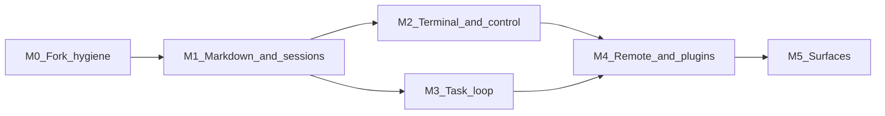

# Backlog

Next steps for Orchestrai, taken from [DECISIONS.md](DECISIONS.md). Each ticket names the decision it comes from, the Warpforge code or ADR it extends, and a check that says when it is done.

Ground rules for every ticket:

- The base is this Warpforge fork. The daemon owns sessions; the window is a client.
- ACP workers (Codex, Claude, Goose, OpenCode, and the rest) stay the model loop. A ticket does not add a second agent loop unless it says so.
- Read `docs/adr/` before touching a subsystem it covers. Add a new ADR when a ticket makes a decision a later reader could not infer from the code.
- Source files stay under 500 lines. Split into a directory module first.
- Every commit carries a changeset. Run `cargo fmt`, `cargo clippy -D warnings`, and the desktop lint and typecheck before committing.

Not tickets, on purpose: AgentDock, Agent Swarm, Goose's file memory, Goose.app, Daintree's Node plugin workers, T3 Connect as the transport, Berd's kgoose tiles, Warp's Oz, Warp Drive, server, and GPU UI framework.

Sizes: **S** is a day or two, **M** is about a week, **L** is more than a week.

## Milestones

| Milestone | Tickets |
| --- | --- |
| M0 Fork hygiene | ORC-01, ORC-02 |
| M1 Markdown and sessions | ORC-03, ORC-04, ORC-05, ORC-06 |
| M2 Terminal and control | ORC-07, ORC-08, ORC-09, ORC-10, ORC-11, ORC-12 |
| M3 Task loop | ORC-13, ORC-14, ORC-15, ORC-16, ORC-17, ORC-18 |
| M4 Remote and plugins | ORC-19, ORC-20, ORC-21 |
| M5 Surfaces | ORC-22, ORC-23, ORC-24, ORC-25, ORC-26 |
| Spikes (any time) | SPIKE-01 to SPIKE-07 (SPIKE-07 done) |

---

## M0 Fork hygiene

### ORC-01 Rename to Orchestrai and give it its own data directory

**Milestone:** M0 · **Size:** M · **Depends on:** none

**Status:** done (2026-10-04, [ADR 0030](../adr/0030-fork-identity.md)). One change from the scope below: projects use `.orchestrai/workspace.yaml` only, and `.warpforge/` is no longer read, so one repo opened by both apps never shares a config.

**Why:** DECISIONS.md "Starting point: fork Warpforge". The public name is orchestrai.tools. Today the dev build calls itself Warpforge (`dev.warpforge.desktop`) and writes `~/.warpforge/daemon.json`, the same file the installed Warpforge 0.21.1 uses. Running both makes them fight over one daemon endpoint.

**Builds on:** `desktop/src-tauri/tauri.conf.json` (`productName`, `identifier`), `Cargo.toml` (package and `[[bin]]` name `warpforge`), `desktop/src-tauri/src/daemon/endpoint.rs`, `src/registry.rs` (`~/.warpforge/projects.json`), ADR 0014, ADR 0017.

**Scope:**
- Product name Orchestrai, bundle id under `tools.orchestrai`.
- Data directory `~/.orchestrai` (endpoint, registry, store). Keep reading project-level `.warpforge/workspace.yaml` so upstream projects still load.
- Rename user-facing strings. Internal crate paths can stay until a later cleanup.

**Out of scope:** migrating data from an existing `~/.warpforge`. Auto-update feed (the upstream feed must be turned off, not repointed, until we publish releases).

**Done when:** the installed Warpforge.app and `bun run tauri dev` of this repo run side by side, each with its own daemon and endpoint file, and neither sees the other's tasks. The updater never offers an upstream Warpforge build.

### ORC-02 Upstream sync policy

**Milestone:** M0 · **Size:** S · **Depends on:** ORC-01

**Why:** we took the fork for its daemon, resume, and worktrees. Upstream keeps fixing those.

**Builds on:** `docs/RELEASING.md`, `.changeset/`.

**Scope:**
- Add an `upstream` remote for `warpforgehq/warpforge`.
- Write down the cadence (for example, merge upstream every two weeks) and who resolves conflicts.
- List the paths that are ours and win on conflict: `docs/product/`, `.cursor/rules/`, rename changes from ORC-01.

**Done when:** a short section in `docs/product/README.md` explains how to merge upstream, and one upstream merge has been done with it.

---

## M1 Markdown and sessions

### ORC-03 Docs library: rendered page and markdown editor

**Milestone:** M1 · **Size:** L · **Depends on:** ORC-01

**Why:** DECISIONS.md opening section. The person lives in markdown: wikis, docs, plans, transcripts. The primary screen must view and edit `.md` well. Chat-only rendering is not enough.

**Builds on:** `desktop/src/components/Markdown.tsx` (react-markdown, remark-gfm, mermaid), `desktop/src/components/CodeEditor/` and `@codemirror/lang-markdown`, `src/daemon/search.rs`. Reference: Zed's markdown preview, which follows the editor's selection and active block (DECISIONS.md "Zed: the ACP client reference").

**Scope:**
- A library view: folders of `.md` files per project and global, virtualized list, full-text search.
- Each page has a rendered view and a CodeMirror markdown editor, side by side or toggled.
- Edits save to disk through the daemon (path confinement from ADR 0017 applies).
- Rendering re-parses only the page being edited, not the library.

**Out of scope:** WYSIWYG block editing, collaborative editing.

**Done when:** a folder of 2,000 markdown files opens in under a second, search returns in under 200 ms, typing in a 5,000-line page does not drop frames, and a save round-trips to disk.

### ORC-04 Transcripts and plans open as markdown pages

**Milestone:** M1 · **Size:** M · **Depends on:** ORC-03

**Why:** the agent's work (plans, transcripts, review prose) is the other large markdown pile.

**Builds on:** `desktop/src/components/ChatTranscript.tsx`, `src/daemon/actor/transcript.rs`, the daemon transcript store.

**Scope:**
- Any task's transcript, plan, and review can open as a page in the library, read-only for transcripts and editable for plans.
- Links from a page to its task, and from a task to its pages.

**Done when:** from a finished task, one click opens its plan and transcript as rendered pages in the library, and search finds text inside transcripts.

### ORC-05 Mission Control session board with continue and fork

**Milestone:** M1 · **Size:** L · **Depends on:** ORC-01

**Why:** DECISIONS.md "Mission Control: take KLIDE's session list". One board for Codex, Claude, and peer sessions, with continue and fork in the app.

**Builds on:** `desktop/src/views/MissionControl.tsx`, `desktop/src/views/mission-control/`, `src/daemon/acp_server.rs` (`session/list`), `src/daemon/acp/session/init.rs` (`loadSession` capability), `src/daemon/tests/sessions/resume.rs`. Reference: Zed's Agent Panel for how ACP work is shown (follow the agent, live multi-file diff) and its thread import from installed agents.

**Scope:**
- The board lists sessions from every enabled ACP agent, including ones this app did not start, when the agent reports them.
- Continue uses `session/load`.
- Fork uses `session/fork` when the agent advertises it. Otherwise the button is hidden, not faked.
- Status per tile comes from ACP updates, not terminal bytes.

**Out of scope:** reading other apps' private session files when the agent has no list call.

**Done when:** a Codex session started outside the app shows up on the board, continues with its history, and a fork makes a second tile whose later turns do not change the original.

### ORC-06 Port command_center plans, approvals, and scoped memory panes

**Milestone:** M1 · **Size:** M · **Depends on:** ORC-03

**Why:** DECISIONS.md "Starting point". `command_center` is ahead on these screens. Port the screens, not its engine.

**Builds on:** `/Users/dev/projects/command_center` (UI reference), `desktop/src/views/TaskDetail.tsx`, `desktop/src/views/Memory.tsx`, `desktop/src/components/PermissionToast.tsx`, `desktop/src/components/AttentionToast.tsx`.

**Scope:**
- A markdown plan pane beside the chat.
- An approvals pane: pending tool permissions across tasks, approve or deny in place.
- Memory shown by scope (global, project, task).
- All state comes from the daemon. No ACP code moves into the Tauri process.

**Done when:** a task with a plan and a pending permission shows both panes, approving from the pane unblocks the agent, and closing the window does not lose the pending approval.

---

## M2 Terminal and control

### ORC-07 Warp process model for terminals

**Milestone:** M2 · **Size:** L · **Depends on:** ORC-01

**Why:** DECISIONS.md "Warp client: copy the open Rust" and "Terminal: Sinew's drawer, Warp's process model". AGPL v3 is accepted for this code.

**Builds on:** `src/agent.rs` (portable-pty and vt100 today), `src/service/spawn.rs`, `src/service/stop.rs`, `desktop/src/components/runtime/TerminalWorkspace.tsx`, `desktop/src/lib/terminalController.ts`. Source: `warpdotdev/warp` `app/src/terminal`, `crates/warp_terminal`.

**Scope:**
- Unix: `openpty`, close-on-exec, controlling terminal, an event loop on the master, `SIGCHLD` for child exit.
- One queued write controller: person input, raw bytes, and agent input share a queue. Writing into a running command is a separate permission from starting one. Handing the terminal back to the person is explicit.
- Command as a block. Exit status and working directory come from shell hooks.
- Each action has an id and a typed cancel result.

**Out of scope:** Warp's GPU UI, Oz, Warp Drive, reversing `conpty.dll`. Windows can stay on the current path.

**Done when:** a killed child is reported within one second, an agent write never interleaves with a person's keystrokes, each command shows its own exit code and cwd, and a new ADR records the AGPL boundary and which files came from Warp.

### ORC-08 Sinew bottom terminal drawer

**Milestone:** M2 · **Size:** M · **Depends on:** ORC-07

**Why:** DECISIONS.md "Terminal: Sinew's drawer". The markdown page stays on top; the terminal is pulled up.

**Builds on:** `desktop/src/components/runtime/TerminalWorkspace.tsx`, `desktop/src/components/RuntimePanel.tsx`. Reference: Sinew's drawer.

**Scope:** a bottom panel with a short tab strip (about 28 px), one tab per session, status on each tab (starting, running, exited), resizable height, a shortcut to toggle it.

**Done when:** the drawer opens over any view, tabs show live status from ORC-07, and the page above keeps its scroll position when the drawer opens and closes.

### ORC-09 Skills catalog and instruction files

**Milestone:** M2 · **Size:** M · **Depends on:** ORC-01

**Why:** DECISIONS.md "Warp client: copy the open Rust".

**Builds on:** `src/daemon/prompt/`, `src/daemon/agents/`. Source: Warp's skills and rules code.

**Scope:**
- One skills catalog across Claude, Codex, Cursor, Gemini, and the other agent directories, with home, project, and bundled scope.
- Instruction files: `WARP.md` wins over `AGENTS.md` in the same directory, ancestor directories apply, `~/.agents/AGENTS.md` is the global file.
- A view that shows which skills and instruction files a task will get.

**Done when:** a task's "context" view lists the exact files it received, and a project with both `WARP.md` and `AGENTS.md` in one folder uses only `WARP.md`.

### ORC-10 Permission profiles and modes

**Milestone:** M2 · **Size:** M · **Depends on:** ORC-06

**Why:** DECISIONS.md "Warp client" (profiles) and "Goose" (modes).

**Builds on:** `src/policies/` (registry and builtins), ACP permission requests in `src/daemon/actor/acp_update.rs`.

**Scope:**
- Named profiles: always allow, always ask, or let the agent decide, per tool kind.
- The denylist is checked before the allowlist. `AlwaysAllow` is never the default.
- Modes per task: Auto, Approve, Smart approve, Chat. A tool can declare itself read-only.
- Profiles are chosen per task and shown in the approvals pane from ORC-06.

**Done when:** a command on the denylist is refused even when the allowlist matches it, a new task starts in a mode that asks, and switching profile mid-task takes effect on the next tool call.

### ORC-11 One action list: palette, control socket, loopback MCP

**Milestone:** M2 · **Size:** L · **Depends on:** ORC-07

**Why:** DECISIONS.md "Daintree" (app actions as MCP tools) and "Warp client" (typed local control socket).

**Builds on:** `src/mcp/` (`serve.rs`, `tools/`), `src/client/`, the desktop quick-open (`desktop/src/app/QuickOpenHost.tsx`).

**Scope:**
- One typed list of app actions (open terminal, launch agent, switch worktree, open page, start task).
- The command palette, keybindings, a local control socket, and the loopback MCP all run from that list.
- Dangerous actions ask for confirmation. The socket and MCP bind to loopback and need a token.

**Done when:** an agent in a panel can call an MCP tool that opens a terminal in the app, the same action appears in the palette, and adding one action to the list makes it available in all three places.

### ORC-12 SSH with one ControlMaster

**Milestone:** M2 · **Size:** M · **Depends on:** ORC-07

**Why:** DECISIONS.md "Warp client: copy the open Rust".

**Builds on:** nothing in the daemon speaks SSH today (`src/portforward/` is local forwarding only). Source: Warp's SSH code.

**Scope:** one master connection per host, extra channels on that socket, teardown only of sessions this app opened.

**Done when:** three terminals to one host open one TCP connection, and quitting the app leaves the user's own `ssh` sessions to that host running.

---

## M3 Task loop

### ORC-13 Task, workflow, and automation, with recipe steps

**Milestone:** M3 · **Size:** L · **Depends on:** ORC-05

**Why:** DECISIONS.md "Tasks, automations, workflows" (Cezar's split) and "Goose" (recipes, `/goal` vs `/grind`).

**Builds on:** ADR 0001 (workflow pipelines), ADR 0007 (scheduled automations), ADR 0023 (backlog runner), ADR 0024 (verify stage), `src/workflow_config/`, `src/workflows/*.yaml`, `src/daemon/workflow/`, `src/daemon/automations/`.

**Scope:**
- A task is one run. A workflow is a reusable recipe. An automation is a trigger that creates a task. Keep them as three separate things in the UI and store.
- Workflow steps take the Goose recipe shape: parameters, retries, a shell success check, an `on_failure` step, an optional response schema.
- Two endings per run: goal (check the result, stop) and grind (continue to a turn cap).
- Automation triggers: schedule (exists), GitHub issue or label, pull request review.

**Done when:** a workflow with a failing shell check retries and then runs its `on_failure` step, a GitHub label creates a task that runs that workflow, and an ADR records how this extends ADR 0001 without breaking its invariants.

### ORC-14 Fan-out, idle wait, and subagents that cannot nest

**Milestone:** M3 · **Size:** M · **Depends on:** ORC-13

**Why:** DECISIONS.md "Warp client" (fan-out and wait) and "Goose" (`delegate` and `load`).

**Builds on:** `src/orchestration/`, `src/mcp/tools/orchestrator.rs`, ADR 0022 (advisor mode).

**Scope:**
- A parent starts several children and waits until each reports, with a spawn timeout and an idle watchdog.
- A child cannot start its own child.
- `load` adopts another agent's instructions into the current run without a new session.
- The parent can peek at or cancel a child. A cap limits how many run at once.

**Done when:** a parent fans out to three children, one child hangs and the idle watchdog reports it, and a child's attempt to spawn is refused with a clear error.

### ORC-15 GitHub page: issues and pull requests

**Milestone:** M3 · **Size:** M · **Depends on:** ORC-13

**Why:** DECISIONS.md "Tasks, automations, workflows, and a GitHub page".

**Builds on:** ADR 0002 (issue tracker integration), ADR 0010 (pull request inbox), `src/daemon/tracker/github/`, `desktop/src/views/InboxView.tsx`.

**Scope:** one page per project with open issues and pull requests, filters, and actions: start a task from an issue, open a task's pull request, see check status.

**Done when:** starting a task from an issue links the two both ways, and the page updates within a minute of a change on GitHub.

### ORC-16 Shep task ending: stop points, CI, draft pull request

**Milestone:** M3 · **Size:** M · **Depends on:** ORC-13, ORC-15

**Why:** DECISIONS.md "Shep: how a finished task meets CI and a pull request".

**Builds on:** ADR 0020 (task pull request status), `src/daemon/pull_status/` (`checks.rs`, `gh.rs`).

**Scope:**
- A task can be set to stop for the person at requirements, plan, or merge.
- After the last stop: push, watch CI, let the agent fix failures up to a set number of times, then open a draft pull request.
- The fix loop stops and asks when the cap is reached.

**Done when:** a task with a failing test pushes, sees CI fail, fixes it on the second attempt, and opens a draft pull request; a task that fails three times stops and asks instead of opening one.

### ORC-17 Project memory written only after a merge

**Milestone:** M3 · **Size:** M · **Depends on:** ORC-16

**Why:** DECISIONS.md "Shep" (second rule). The store stays the Warpforge index.

**Builds on:** `src/daemon/memory/` (`store.rs`, `search.rs`, `embeddings.rs`), `src/daemon/memory_dream.rs`, `desktop/src/views/Memory.tsx`.

**Scope:**
- When a task's pull request merges, write its lessons as project memory.
- On the next run in that project, inject a short ranked slice (a fixed token budget).
- Memory from unmerged tasks is not written as project memory.

**Done when:** a merged task's memory appears in the next task's prompt within the budget, and an abandoned task's run leaves the project memory unchanged.

### ORC-18 Daemon tool hygiene: shell truncation and unique-match edit

**Milestone:** M3 · **Size:** S · **Depends on:** none

**Why:** DECISIONS.md "Goose: take the loop habits". These apply to tools this app exposes, not to the workers' own tools.

**Builds on:** `src/mcp/tools/runtime.rs`, `src/mcp/tools/runner.rs`, `src/mcp/logs.rs`.

**Scope:**
- Shell and log tools return the last lines, stdout, stderr, the exit code, and whether it timed out. The full output goes to a temp file whose path is in the result.
- Any edit tool refuses when the old text is missing or appears more than once, and returns a preview and the nearest match.

**Done when:** a command with 50,000 lines of output returns a short result with a file path, and an ambiguous edit writes nothing.

---

## M4 Remote and plugins

### ORC-19 Phone remote over Sinew's relay

**Milestone:** M4 · **Size:** L · **Depends on:** ORC-05, ORC-10

**Why:** DECISIONS.md "Remote: take Sinew's phone relay". Off-LAN, no account, relay never sees plaintext.

**Builds on:** `src/daemon/server/`, `src/daemon/wire.rs`. Reference: Sinew `remote/server.mjs` and its pairing code.

**Scope:**
- 6-digit pairing code (5-minute life, 5 attempts, then a 60-second lock) plus ECDH. Session key derived as Sinew does. Messages AES-256-GCM.
- The daemon and the phone each open an outbound WebSocket to the relay. The relay URL is a setting, and the relay program ships in the repo so it can be self-hosted.
- A phone PWA: session board, read a transcript, send a prompt, approve or deny a permission.

**Out of scope:** native iOS or Android (T3's phone app is the later target), T3 Connect, Cloudflare tunnels.

**Done when:** a phone on cellular pairs with a code, sees the session board, approves a pending permission, and a relay log shows only ciphertext.

### ORC-20 WASM plugin host for agent tools

**Milestone:** M4 · **Size:** L · **Depends on:** ORC-11

**Why:** DECISIONS.md "Plugins: WASM tool calls, Zellij-style".

**Builds on:** `src/mcp/tools/` (where plugin tools would register), ORC-11's action list.

**Scope:**
- A Rust host loads `.wasm` modules in a sandbox. A plugin reaches the filesystem or network only through the host API, with capabilities granted per plugin.
- A plugin registers new tools the agent can call. Calls go through ORC-10's permission check.

**Out of scope:** Node plugin workers. Plugins that draw panes.

**Done when:** a sample plugin adds one tool an agent can call, and the same plugin trying to read a file outside its grant gets an error from the host.

### ORC-21 Browser profiles from Chrome

**Milestone:** M4 · **Size:** M · **Depends on:** none

**Why:** DECISIONS.md "Browser: copy T3's Chrome profile".

**Builds on:** ADR 0021 (agent-driven browser), `src/daemon/browser/`, `desktop/src-tauri/src/browser_agent.rs`, `src/mcp/tools/browser.rs`.

**Scope:**
- Settings, add profile, import from Chrome (Chrome must be quit). On macOS, read "Chrome Safe Storage" from the keychain and copy cookies into a named profile. Passwords are not copied.
- The agent and hand-opened tabs share the Default profile unless a call names another.

**Out of scope:** Windows Chrome import, driving the live Chrome window.

**Done when:** after import, the in-app preview opens a site the user is signed into in Chrome without a new login, and the agent's browser tool uses the same session.

---

## M5 Surfaces

### ORC-22 Helmor first run

**Milestone:** M5 · **Size:** M · **Depends on:** ORC-01, ORC-09

**Why:** DECISIONS.md "Onboarding: copy Helmor's first run".

**Builds on:** `desktop/src/components/BootstrapWizard.tsx`, `desktop/src/views/AgentSetupDialog.tsx`, `desktop/src/views/AddProjectDialog.tsx`. Reference: `dohooo/helmor` `src/features/onboarding`, and the ACP Registry (as Zed uses it) as the source for installing agents.

**Scope:** fixed 1300 by 810 window, not resizable, centered. Steps: intro, sign in agents, connect GitHub or GitLab, skills, add a repo from disk or a clone URL. A mock of the real workspace beside the steps. Agent login status is live and refreshes on focus. Completion is stored.

**Done when:** a fresh data directory opens into this flow, each agent's sign-in state updates without restarting, and finishing lands in the workspace with the repo added.

### ORC-23 Landing screen

**Milestone:** M5 · **Size:** S · **Depends on:** ORC-01

**Why:** DECISIONS.md "Buzz: the landing page".

**Builds on:** reference `LandingBees` in Buzz `MachineOnboardingFlow.tsx`.

**Scope:** a first screen before onboarding: wordmark, one line, a field of shapes that drift and move away from the pointer. Respects reduced motion.

**Done when:** the screen holds 60 fps on a laptop and shows a still version with reduced motion on.

### ORC-24 Many-harness panel grid and the QuickRun command bar

**Milestone:** M5 · **Size:** L · **Depends on:** ORC-07, ORC-11

**Why:** DECISIONS.md "Daintree: the UI for many harnesses at once".

**Builds on:** `desktop/src/views/Projects.tsx`, `desktop/src/components/runtime/TerminalWorkspace.tsx`, `react-grid-layout` (already a dependency).

**Scope:**
- A panel grid of live agents and shells. A shell becomes an agent panel when you type the agent's name. Broadcast one prompt to selected panels.
- The command bar at the bottom of the left sidebar: a `$` field for shell commands only, with saved commands, package scripts, and history, scoped to the selected worktree. Running commands sit above it. It never sends a prompt to an agent.
- Panel status comes from ACP updates or hooks, not terminal-byte guessing.

**Done when:** four agents run in one grid, a broadcast reaches all four, and a saved command from the bar runs in the selected worktree's terminal.

### ORC-25 Agents page, teams, and channels

**Milestone:** M5 · **Size:** L · **Depends on:** ORC-05, ORC-14

**Why:** DECISIONS.md "Buzz: an AI Slack".

**Builds on:** `desktop/src/views/settings/` (agent setup), `src/daemon/agents/`. Reference: Buzz `AgentsView`, `TeamsSection`.

**Scope:**
- An Agents page: who each agent is, whether it is running, and the defaults it inherits.
- Teams: a named group of agents you can add to a channel at once.
- A channel is a shared room. People and agents are members and read the same thread. A mention steers one agent.

**Out of scope:** Nostr relay, Builderlab accounts, multi-user sync across machines.

**Done when:** adding a team to a channel makes every member reply to a mention by name, and each agent's reply is visible to the whole channel.

### ORC-26 Canvas home

**Milestone:** M5 · **Size:** L · **Depends on:** SPIKE-01, ORC-05

**Why:** DECISIONS.md "Berd: unique UI, canvas home".

**Builds on:** `desktop/src/views/MissionControl.tsx`. Reference: Berd `src/features/home`.

**Scope:** a free-placement board of widgets (agents, chats, projects, skills, notes, report pages), each with its own position and layer, saved per user. Built to read well on a large monitor.

**Done when:** widgets can be placed, resized, and layered, the layout survives a restart, and agent tiles update live.

---

## Spikes

Each spike ends with a short written verdict added to [DECISIONS.md](DECISIONS.md), not code on `main`.

### SPIKE-01 Berd: port the whole UI, or only the canvas home

**Size:** S. **Why:** DECISIONS.md "Berd". **Question:** what it costs to port Berd's UI onto this fork versus only its home canvas, and what we lose either way. **Output:** a verdict that unblocks ORC-26.

### SPIKE-02 Remote agent over SSH

**Size:** S. **Why:** DECISIONS.md "Berd" (SSH remote). **Question:** can a remote ACP agent (for example `goose serve`) stay up on a host while the app reaches it through `ssh -N -L`, and does it fit ORC-12's ControlMaster? **Output:** a verdict and a list of daemon changes.

### SPIKE-03 Voice conversation

**Size:** S. **Why:** DECISIONS.md "Berd" (phone conversation). **Question:** on-device speech versus OpenAI speech versus Realtime, talking while the agent streams, and cost per hour. Separate from ORC-19's relay. **Output:** a verdict and a recommended first provider.

### SPIKE-04 Jujutsu beside Git

**Size:** M. **Why:** DECISIONS.md "Version control: look into Jujutsu". **Question:** what a `jj` driver needs for status, commit, worktrees (`jj workspace`), and checkpoints, and which Warpforge paths call Git directly today (see ADR 0015). **Output:** a verdict and an estimate. T3 is not a source.

### SPIKE-05 Native-CLI wrapper

**Size:** S. **Why:** DECISIONS.md "KLIDE's wrapper". **Question:** which CLIs we still want cannot be hosted over ACP, and whether a PTY daemon that survives the window (KLIDE's `ptyd`) is needed for them. **Output:** a list of CLIs and a yes or no on the wrapper.

### SPIKE-06 Optional direct model loop

**Size:** S. **Why:** DECISIONS.md "Direct LLM". **Question:** is a first-party loop worth having beside ACP workers, and if so, is Sinew's `run_turn` the base? It must fix Sinew's gaps: long runs that die with the window, unsandboxed shell, no approvals. **Output:** a go or no-go.

### SPIKE-07 Zed as the base

**Size:** S. **Status:** done, 30 September 2026. **Why:** DECISIONS.md "Zed: the ACP client reference", and the question of whether Zed's headless server could replace the Warpforge daemon.

**Verdict:** no. Written up in DECISIONS.md "Spike: Zed as the base". On `origin/main` `40180d9c40`, `AcpConnection` lives in the window and kills the agent on drop, including SSH projects where the child is a local `ssh`. Resume via `load_session` exists and is capability-gated, and threads still load empty after restart (Zed issue 54750, open). The Warpforge fork stays the base.
